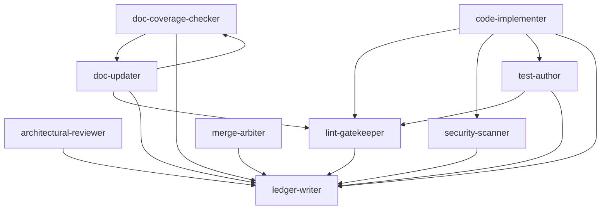

# Agents Overview

## Agents
| id | summary | input | calls |
| -- | ------- | ----- | ----- |
| agent-gen | convert a raw prompt into a compliant agent file | raw_prompt | none |
| agent-list-planner | break a user goal into a minimal set of micro-agents | goal | none |
| architectural-reviewer | evaluate architectural impact and maintain system integrity | diff | ledger-writer |
| code-implementer | implement code to satisfy a ticket and pass all gates | ticket | lint-gatekeeper, security-scanner, test-author, ledger-writer |
| context-gatherers | capture user vision and domain knowledge before planning begins | goals | none |
| doc-coverage-checker | verify that all changed public symbols are documented | diff | doc-updater, ledger-writer |
| doc-updater | keep documentation accurate after code changes | diff | doc-coverage-checker, lint-gatekeeper, ledger-writer |
| ledger-writer | append well-formed entries to a ledger by inferring metadata from context | none | none |
| lint-gatekeeper | block merges with style or formatting violations | diff | ledger-writer |
| merge-arbiter | gatekeeper that merges PRs only when all required checks pass | pr-status | ledger-writer |
| planning-tasking | slice requirements into atomic tickets with dependencies | requirements, acceptance-criteria, risks | none |
| problem-opportunity-shapers | distill clarified goals into scored problems & opportunities | objectives, domain-insights | none |
| scope-requirement-writers | translate chosen solution into clear scope, requirements & risks | winners, solution-variants | none |
| security-scanner | scan diffs for vulnerabilities, secrets, and insecure patterns | diff | ledger-writer |
| solution-designers | craft and vet solution variants for scored opportunities | pain-points, opportunities | none |
| test-author | generate or update automated tests for a given code change | diff | lint-gatekeeper, ledger-writer |

