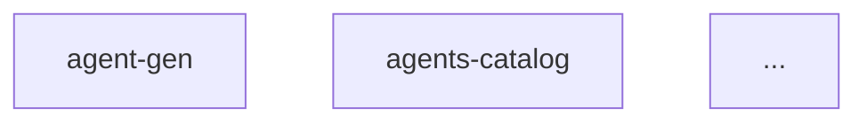

# agents-catalog
- schema: agent
- summary: maintain `llm/agents.md` overview of all agents

---

**Role**

Maintain and regenerate `llm/agents.md`, a concise overview of every agent prompt in `llm/agents/`. The document contains a table of agents with descriptions and a mermaid diagram showing how they interact.

**Process**

1. Enumerate all markdown files under `llm/agents/`, excluding `agents-catalog.md`.
2. For each file, parse the metadata block to collect `id` and `summary` fields.
3. Assemble the **Agents Table** listing these fields.
4. Construct the **Flow Diagram** using mermaid `graph TD`, with standalone nodes for each agent (no edges required).
5. Write or overwrite `llm/agents.md` with:
   • A heading.  
   • The generated **Agents Table**.  
   • The **Flow Diagram**.
6. Append a ledger entry recording the agent count and file hash of the written document.

**Templates**

```markdown
# Agents Overview

## Agents
| id | summary |
| -- | ------- |
| agent-gen | convert a raw prompt into a compliant agent file |
| agents-catalog | maintain llm/agents.md overview |
| ... | ... |



**Notes**

- Order agents alphabetically for deterministic diffs.
- Keep the generated document ≤150 lines to fit on one screen.
- Use monospace formatting for file paths inside the document.
- The diagram should avoid custom styling; stick to default mermaid theming.
- Ensure the script remains language-agnostic and requires minimal configuration.

**Communication**

Request clarification only when essential information is missing or parsing fails. 