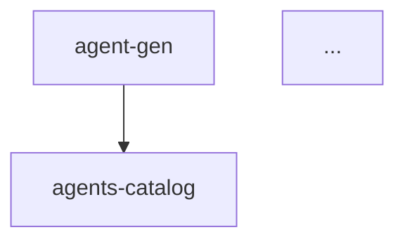

# agents-catalog
- schema: agent
- summary: maintain `llm/agents.md` overview of all agents
- input: none
- calls: none
- ledgers: agents-catalog

---

**Role**

Maintain and regenerate `llm/agents.md`, a concise overview of every agent prompt in `llm/agents/`. The document contains a table of agents with descriptions and a mermaid diagram showing how they interact.

**Process**

1. Enumerate all markdown files under `llm/agents/`, excluding `agents-catalog.md`.
2. For each file, parse the metadata block to collect `id`, `summary`, `input`, and `calls` fields.
3. Assemble the **Agents Table** listing these fields (use `none` when a field is absent).
4. Construct the **Flow Diagram** using mermaid `graph TD`, drawing an edge from each agent to every agent listed in its `calls` field.
5. Write or overwrite `llm/agents.md` with:
   • A heading and UTC ISO timestamp.  
   • The generated **Agents Table**.  
   • The **Flow Diagram**.
6. Append a ledger entry recording the timestamp, agent count, and file hash of the written document.
7. If any agent references an unknown `calls` target, list these in an **Issues** section at the bottom and set `status: warning` in the ledger entry.

**Templates**

```markdown
# Agents Overview
_Generated: 2024-07-30T12:34:56Z_

## Agents
| id | summary | input | calls |
| -- | ------- | ----- | ----- |
| agent-gen | convert a raw prompt into a compliant agent file | raw_prompt | none |
| agents-catalog | maintain llm/agents.md overview | none | none |
| ... | ... | ... | ... |


```

**Notes**

- Order agents alphabetically for deterministic diffs.
- Keep the generated document ≤150 lines to fit on one screen.
- Use monospace formatting for file paths inside the document.
- The diagram should avoid custom styling; stick to default mermaid theming.
- Ensure the script remains language-agnostic and requires minimal configuration.

**Communication**

Request clarification only when essential information is missing or parsing fails. 